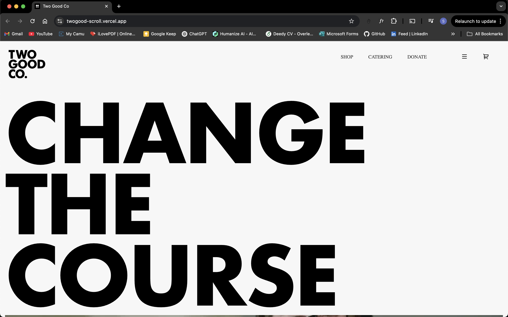

# 🌟 TwoGood Scroll – Web Experience

Welcome to **TwoGood Scroll**, a visually engaging scroll-based web experience crafted using HTML, CSS, and JavaScript. This project showcases a creative blend of custom fonts, smooth animations, and multimedia integration to deliver a stunning storytelling layout.

🚀 [Live Demo](https://twogood-scroll.vercel.app/)

---

## 📁 Project Structure

```

📦 twogood-scroll/
├── css/             → Stylesheets for layout and animations
├── fonts/           → Custom fonts used throughout the project
├── js/              → JavaScript for interactivity and scroll effects
├── favicon.ico      → Website favicon
├── index.html       → Main HTML file
└── README.md        → Project documentation

````

---

## 💡 Features

- 🔥 **Parallax Scrolling** – Smooth and captivating scroll transitions
- 🎨 **Custom Fonts** – Typography that enhances the design tone
- 📹 **Video Integration** – Background or embedded video support
- 💻 **Responsive Design** – Adapts well across devices 
- ⚡ **Minimal & Elegant UI** – Designed with aesthetics in mind

---

## 📦 Built With

- **HTML5** – Semantic structure
- **CSS3** – Flexbox, transitions, responsive layout
- **JavaScript** – DOM manipulation and scroll-triggered effects

---

## 🌐 Deployment

This project is live on **Vercel**:
👉 [https://twogood-scroll.vercel.app](https://twogood-scroll.vercel.app)

---

## 🛠️ Getting Started

1. Clone the repository:

```bash
git clone https://github.com/Itssanthoshhere/twogood-scroll.git
````

2. Open the project folder:

```bash
cd twogood-scroll
```

3. Open `index.html` in your browser to preview locally.

---

## 📸 Preview




---

## 🛠️ Tools & Libraries Used

| Tool/Library                                                            | Purpose                    |
| ----------------------------------------------------------------------- | -------------------------- |
| [GSAP](https://greensock.com/gsap/)                                     | Smooth animations          |
| [Locomotive Scroll](https://locomotivemtl.github.io/locomotive-scroll/) | Custom scroll behavior     |
| [Google Fonts](https://fonts.google.com/)                               | Typography                 |


--- 

## 🙌 Acknowledgements

This project was inspired by creative scrolling web experiences. Thanks to all the open-source fonts and libraries used!

* Inspired by the amazing design of [Two Good Co](https://www.twogood.com.au/)
* Special thanks to GSAP and Locomotive Scroll documentation


---

## 📫 Contact

Feel free to connect with me:

* GitHub: [Itssanthoshhere](https://github.com/Itssanthoshhere)
* LinkedIn: [Santhosh VS](https://www.linkedin.com/in/thesanthoshvs/)

---

## ⭐️ Show Your Support

If you liked this project, drop a ⭐ on the repo and share it with others!

